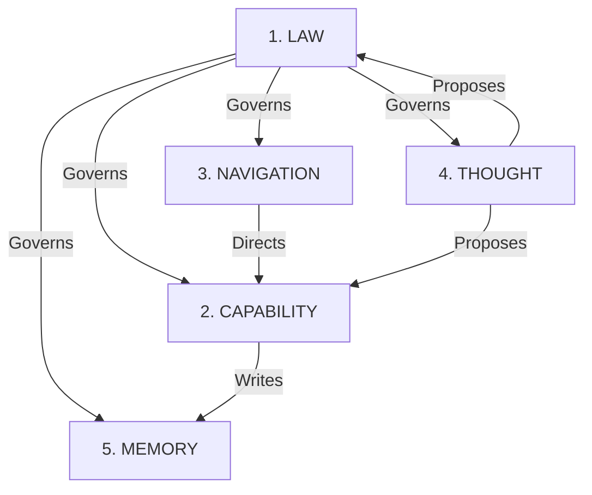

<!-- CONTENT_HASH: 92393a477f10ec776f55900edf553fd33b0fbe3066a62dfb76366b1dc70d1630 -->

# System Map

This map describes the 5-Bucket Architecture of the Agent Governance System.

## 1. LAW (The Rules)
*Purpose: Permissibility & Authority*
- `CANON/`: Immutable laws and contracts
- `CONTRACTS/`: Run ledgers and enforcement
- `CONTEXT/decisions/`: ADRs and precedents
- `AGENTS.md`: Operating strictures

## 2. CAPABILITY (The Tools)
*Purpose: Potential Action*
- `SKILLS/`: Agent toolkits
- `TOOLS/`: Maintenance scripts & Critics
- `MCP/`: Hardware interface
- `PIPELINES/`: Distributed execution patterns
- `PRIMITIVES/`: Core safety blocks

## 3. NAVIGATION (The Map & Plan)
*Purpose: Orientation & Strategy*
- `CORTEX/`: Semantic database & Index
- `maps/`: Data flow and ownership maps

## 4. THOUGHT (The Lab)
*Purpose: Exploration*
- `LAB/`: Experimental features
- `CONTEXT/research/`: Non-binding analysis
- `CONTEXT/demos/`: Proof of concepts

## 5. MEMORY (The Record)
*Purpose: History*
- `MEMORY/`: Packed archives
- `INBOX/reports/`: Signed implementation reports
- `CONTEXT/archive/`: Deprecated content
- `_runs/`: Execution ledgers (logically here, physically in LAW/CONTRACTS/_runs due to INV-006)

---

## Data Flow
See `DATA_FLOW.md` for artifact lifecycles.

## File Ownership
See `FILE_OWNERSHIP.md` for team responsibilities.
